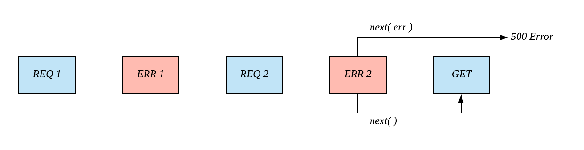

### Error Handler

`요청 핸들러`와 다르게 `에러 핸들러`는 4개의 인자를 가지고 있습니다.

```ts
import express, { ErrorRequestHandler } from "express";

const errHandler: ErrorRequestHandler = async function (err, req, res, next) {
    res.status(500).send("에러 발생!");
};
```

<br/>

또한 `use()`를 사용하여 `요청 핸들러`와 혼용될 수 있습니다. 단, 순서에 유의하여 적용해야 하는데, 그 이유는 다음 절에서 설명합니다.

```ts
app.use(req_handler_1);
app.use(err_handler_1);
app.use(req_handler_2);
app.use(err_handler_2);
```

<br/>

### 호출 순서

아래와 같이 적용된 상황을 예시로 들겠습니다.

```ts
app.use(req_handler_1);
app.use(err_handler_1);
app.use(req_handler_2);
app.use(err_handler_2);

app.get("/", async function get(req, res) {
    res.send("Hello, World!");
});
```

이것을 그림으로 표현하면 다음과 같습니다.


<br/>

위의 그림을 인지한 상황에서, 다음 2가지 규칙에 의해 호출순서가 결정됩니다.

-   `next()`에 에러가 전달되었다면 `가장 가까운 다음 에러 핸들러`가 호출됩니다.
-   `next()`에 에러가 전달되지 않았다면 `가장 가까운 다음 요청 핸들러`가 호출됩니다.

<br/>

예를 들어 `REQ1`에서 `next(err)`를 사용하면 가장 까가운 다음 에러 핸들러인 `ERR1`이 호출됩니다. 반대로 `next()`를 사용하면 가장 가까운 요청 핸들러인 `REQ2`가 호출됩니다.


<br/>

다시 `ERR1`에서 `next(err)`를 사용하면 가장 까가운 다음 에러 핸들러인 `ERR2`가 호출됩니다. 반대로 `next()`를 사용하면 가장 가까운 요청 핸들러인 `REQ2`가 호출됩니다.


<br/>

마지막으로 `ERR2`에서 `next(err)`를 사용하면 더 이상 에러 핸들러가 없으므로 `500 에러`가 발생합니다. 반대로 `next()`를 사용하면 가장 가까운 요청 핸들러인 `GET`이 호출됩니다.


