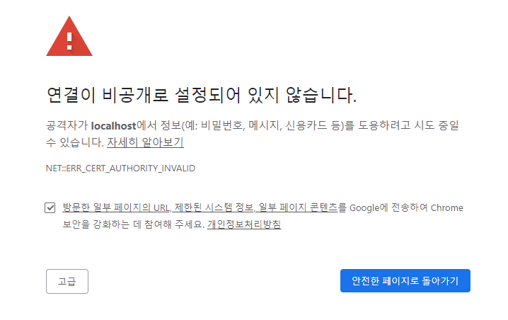

### HTTPS

`SSL 인증서`를 사용하여 `express.js`를 `HTTPS`로 실행시킬 수 있습니다.

<br/>

#### 테스트 인증서 얻기

다른 곳에서 발급된 `SSL 인증서`가 있다면 그것을 사용해도 좋지만, 없는 경우에는 `selfsigned` 라이브러리를 사용하여 `임시 인증서`를 취득할 수 있습니다.

```bash
npm install selfsigned;
```

```ts
import selfsigned from "selfgiend";

const pems = selfsigned.generate();
```

```json
pems {
    "private": "...",
    "public": "...",
    "cert": "...",
    "fingerprint": "..."
}
```

<br/>

#### 인증서로 HTTPS 서버 실행하기

내장된 `https` 모듈을 사용하여 `app`과 `SSL`을 연결하고 실행할 수 있습니다.

```ts
import https from "https";

//
// OPEN SSL 인증서
const pems = selfsigned.generate();

export function startServer() {
    //
    // OPEN SSL 인증서
    const pems = selfsigned.generate();

    //
    // HTTPS로 실행
    https
        .createServer(
            {
                key: pems.private,
                cert: pems.cert,
            },
            app
        )
        .listen(3000, () => {
            console.log("https://localhost:3000");
        });
}
```

<br/>

단, `임시 인증서`는 브라우저가 신뢰하지 않음에 유의해주세요. 다음 사진과 같이 경고를 보낼 것 입니다. 따라서, 테스트 목적으로는 좋지만, 라이브에는 적합하지 않습니다.


