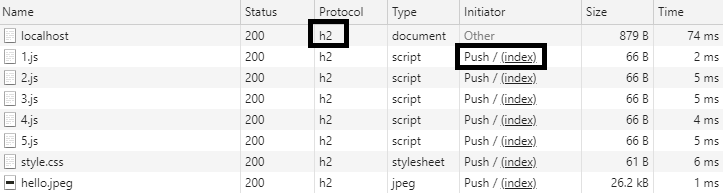

### HTTP2

`SSL 인증서`를 사용하여 `express.js`를 `HTTP2`로 실행시킬 수 있습니다.

<br/>

#### 테스트 인증서 얻기

다른 곳에서 발급된 `SSL 인증서`가 있다면 그것을 사용해도 좋지만, 없는 경우에는 `selfsigned` 라이브러리를 사용하여 `임시 인증서`를 취득할 수 있습니다.

```bash
npm install selfsigned;
```

```ts
import selfsigned from "selfgiend";

const pems = selfsigned.generate();
```

```json
pems {
    "private": "...",
    "public": "...",
    "cert": "...",
    "fingerprint": "..."
}
```

<br/>

#### 인증서로 HTTP2 서버 실행하기

2020년 7월 기준으로 `Express4`는 아직 `http2` 모듈과 호환되지 않고 있습니다. 따라서 `spdy` 모듈을 사용하여 `http2` 서버를 실행합니다.

```bash
npm i spdy
npm i @types/spdy -D
```

<br/>

이제 `spdy` 모듈을 사용하여 `app`과 `SSL`을 연결하고 실행할 수 있습니다.

```ts
import express from "express";
import spdy from "spdy";

// @ts-ignore
import selfsigned from "selfsigned";

//
// express의 기본 모듈을 사용하여 app 객체를 생성.
export const app = express();

//
// server bootstrap function
export function startServer() {
    //
    // OPEN SSL 인증서
    const pems = selfsigned.generate();

    //
    // HTTP2 서버 생성
    spdy.createServer(
        {
            key: pems.private,
            cert: pems.cert,
        },
        app
    ).listen(3000, () => {
        console.log("http2", "https://localhost:3000");
    });
}
```

<br/>

단, `임시 인증서`는 브라우저가 신뢰하지 않음에 유의해주세요. 다음 사진과 같이 경고를 보낼 것 입니다. 따라서, 테스트 목적으로는 좋지만, 라이브에는 적합하지 않습니다.


<br/>

#### Server Push

`http/2`의 주요한 특징 중 하나는 `Server Push`입니다. `http/1.1`은 한 번의 커넥션이 하나의 파일밖에 전달할 수 없지만, `http/2`은 `양방향 스트림`을 통해 하나의 커넥션이 수 많은 파일을 전달할 수 있습니다.

<br/>

위의 기능을 체험하기 위해 간단한 웹서버 하나를 생성합니다. 동일한 `app`을 각각 `http/1.1`과 `http/2`로 실행하며, 인덱스 페이지의 `HTML`은 다음과 같습니다.

```html
<html>
    <head>
        <title>HTTP2 Push Test</title>
        <script src="/resources/1.js"></script>
        <script src="/resources/2.js"></script>
        <script src="/resources/3.js"></script>
        <script src="/resources/4.js"></script>
        <script src="/resources/5.js"></script>
        <link rel="stylesheet" type="text/css" href="/resources/style.css"></link>
    </head>
    <body>
        </img>
        <div>Hello, World!</div>
    </body>
</html>
```

즉, 인덱스 페이지를 로딩하기 위해서는 총 6개의 추가적인 자원이 필요합니다.

-   `/resources/1.js`
-   `/resources/2.js`
-   `/resources/3.js`
-   `/resources/4.js`
-   `/resources/5.js`
-   `/resources/style.css`

<br/>

`Server Push`는 자동으로 이루어지는 것이 아닌, 프로그래머에 의해 명시적으로 이루어지는 기능이므로, 다음과 같이 필요한 자원들을 수동으로 밀어넣어야 합니다.

```ts
app.get("/", async function (req, res) {
    //
    // Hand over the necessary resources to the client.
    function pushFile(filePath: string) {
        //
        // Check if push is possible.
        if ((res as any).push) {
            //
            // Create push stream.
            const stream: Writable = (res as any).push(filePath, {
                req: { accept: "**/*" },
                res: {},
            });

            //
            // Register error event.
            stream.on("error", console.log);

            //
            // Write file to stream asynchronously.
            fs.readFile(path.join(__dirname, filePath), (err, buffer) => {
                if (err) {
                    //
                    // Failed to read file.
                    console.log(err);
                    stream.end();
                } else {
                    //
                    // If the file was read successfully.
                    stream.end(buffer);
                }
            });
        }
    }

    //
    // List of required files
    const filePaths = [
        "/resources/1.js",
        "/resources/2.js",
        "/resources/3.js",
        "/resources/4.js",
        "/resources/5.js",
        "/resources/hello.jpeg",
        "/resources/style.css",
    ];

    //
    // Send required files.
    filePaths.forEach((filePath) => pushFile(filePath));

    //
    // Send HTML File.
    res.sendFile(path.join(`${__dirname}/index.html`));
});
```

<br/>

`Http/1.1` 호환을 위해 `express.static` 미들웨어를 함께 달겠습니다.

```ts
//
// Use static middleware.
app.use("/resources", express.static(__dirname + "/resources"));
```

<br/>

몇 번의 커넥션이 이루어졌는지 알기 위해 `Express Logger`인 `morgan`을 함께 적용합니다. 아래의 코드는 `커넥션이 이루어질 때 마다` 요청된 경로를 콘솔에 출력합니다.

```ts
app.use(morgan(":url"), function (req, res, next) {
    next();
});
```

<br/>

먼저 크롬을 통해 `HTTP` 서버로 접속하면 프로토콜에는 다음과 같이 `http/1.1`이란 항목이 뜨며, 각 자원마다 추가적인 커넥션을 요구합니다. 서버의 로그 기록에서 각 자원의 `url`이 로깅된 것에 주목해주세요.


<br/>

반면 `HTTP/2.0`이 적용된 `HTTPS` 서버로 접속하면 프로토콜에는 `h2`이란 항목이 뜨며, `push`된 자원은 `Initiator` 항목을 통해 확인할 수 있습니다. 클라이언트는 `push`된 자원을 사용했기 때문에 서버의 로그가 깔끔해진 것에 주목해주세요.




<br/>

#### Server Push는 WebSocket이 아니다

일부 블로그의 포스팅은 `Server Push`를 다음과 같이 소개하고 있습니다.

<br/>

> 클라이언트가 요청하지 않아도 아무때나 자원을 보낼 수 있다.

<br/>

`Server Push`는 커넥션이 발생되었을 때, 사용자가 요청하지 않았던 `여러개의 파일`을 밀어넣는 기능이며, 클라이언트에게 비동기적인 메세지를 보내고 싶다면 `WebSocket`이라는 기술을 사용해야 합니다. 위에서 소개한 설명은 `WebSocket`에 더 가깝다고 볼 수 있습니다.
