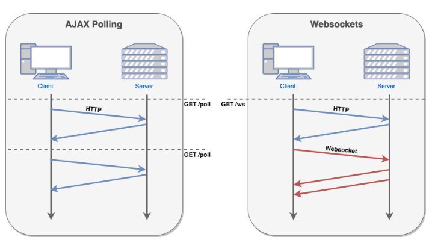

### WebSocket

`웹소켓`은 서버와 클라이언트 간의 `실시간 양방향 통신`을 구현하기 위한 기술입니다. 이 기술이 나오기 전까지는 일정 주기마다 새로운 데이터가 있는지 확인하는 `풀링`을 사용했지만, 발생시점과 확인시점에 `Delay`가 있기 때문에 `Near-Time`에 가까웠습니다. `웹소켓`이 나오고 나서야 비로소 `Real-Time 양방향 통신`을 구현할 수 있게 된 것이죠.



이번 장에서는 `Socket.io`를 사용하여 `WebSocket`을 다뤄보겠습니다.

<br/>

### Socket-io

`Socket.io`는 웹소켓과 동일한 기능을 가졌지만, `웹소켓의 스펙을 그대로 구현한 것은 아닙니다`. 웹소켓은 비교적 최신의 기술이기 때문에 `구형 브라우저`에서는 지원하지 않지만, `Socket.io`는 구형 브라우저에서도 작동될 수 있게 설계되었기 때문입니다.

<br/>

따라서, 아래와 같이 `Socket.io`서버는 `브라우저에 내장된 WebSocket`으로 접근할 수 없습니다.

```js
const client = new WebSocket(...);
```

위의 방식으로 `Socket.io`에 접근하려고 하면, 다음과 같이 `Hand-Shake` 에러가 발생합니다.

```text
failed: connection closed before receiving a handshake response
```

<br/>

### Server-Side Tutorial

#### 시작하기

먼저 `Socket.io`를 설치합니다.

```bash
npm i socket.io
npm i @types/socket.io -D
```

<br/>

`Socket.io` 혼자서도 운용될 수 있지만, 여기서는 다음과 같이 `express`와 통합합니다.

```ts
import express from "express";
import http from "http";
import socketIo from "socket.io";

const app = express();
const httpServer = http.createServer(app);
const socketServer = socketIo(httpServer);
```

<br/>

`httpServer`를 시작하면, 자동으로 `express`와 `socket.io`도 시작됩니다.

```ts
httpServer.listen(3000);
```

<br/>

이제 웹소켓 클라이언트가 접속할 때 까지 기다립니다.

<br/>

#### 커넥션 감지

클라이언트가 웹소켓 서버와 연결되면 `connection` 이벤트가 발생합니다. 이를 감지하기 위해 `.on("connection", CALLBACK)`을 사용하여 콜백을 등록해야 합니다.

```ts
const socketServer = socketIo(httpServer);

//
// 클라이언트와 연결되면 실행할 콜백.
socketServer.on("connection", (socket) => {
    console.log("새로운 유저가 접속했습니다.");
});
```

<br/>

각 소켓은 `고유 식별자`를 가지고 있으므로, 이것을 사용하면 각각의 소켓이 누구인지 판별할 수 있습니다.

```ts
const socketServer = socketIo(httpServer);

//
// 클라이언트와 연결되면 실행할 콜백.
socketServer.on("connection", (socket) => {
    console.log(`새로운 유저가 접속했습니다. [id = ${socket.id}]`);
});
```

<br/>

#### 커넥션 해제 감지

아쉽지만 `disconnection` 이벤트는 존재하지 않습니다. 굳이 필요하다면 일정 주기로 `socket.disconnected` 플래그를 확인하세요.

<br/>

#### 이벤트 송수신

서버와 클라이언트는 `이벤트 이름`와 `데이터`로 이루어진 메세지를 사용하여 데이터를 교환합니다. 이 때, 서버와 클라이언트는 `어떤 이벤트는 이렇게 처리할거야!`라고 미리 정해두어야 합니다.

```ts
class Message {
    eventName: string;
    data: any;
}
```

<br/>

`.on()`을 통해 클라이언트가 보낸 이벤트를 수신할 수 있습니다.

```ts
const socketServer = socketIo(httpServer);

//
// 클라이언트와 연결되면 실행할 콜백.
socketServer.on("connection", (socket) => {
    console.log(`새로운 유저가 접속했습니다. [id = ${socket.id}]`);

    //
    // 클라이언트가 "chat" 이벤트를 발생시키면 실행할 콜백.
    socket.on("chat", function (data) {
        console.log(`[${socket.id}]로부터 "chat" 이벤트 발생 : ${data}`);
    });
});
```

<br/>

`.emit()`을 통해 `이벤트를 발생시킨 클라이언트`에게 이벤트를 송신할 수 있습니다. `.broadcast.emit()`을 사용하면 `이벤트를 발생시킨 클라이언트를 제외한` 모든 클라이언트에게 이벤트를 송신합니다. `.to().emit()`를 사용하면 `주어진 id와 일치하는 클라이언트`에게 이벤트를 송신할 수 있습니다.

```ts
const socketServer = socketIo(httpServer);

//
// 클라이언트와 연결되면 실행할 콜백.
socketServer.on("connection", (socket) => {
    console.log(`새로운 유저가 접속했습니다. [id = ${socket.id}]`);

    //
    // 클라이언트가 "chat" 이벤트를 발생시키면 실행할 콜백.
    socket.on("chat", function (data) {
        try {
            //
            // 이벤트 발생자를 제외한 모두에게 채팅 메세지를 전달한다.
            socket.broadcast.emit(
                "chat",
                `[${socket.id}]님이 보낸 메세지 : ${data}`
            );
        } catch (e) {
            //
            // 이벤트 발생자에게 에러 메세지를 전달한다.
            socket.emit("error", "에러가 발생했습니다. 다시 보내주세요.");

            //
            // 시스템 관리자에게 경고 메세지를 전달한다.
            socket
                .to(관리자의_소켓_아이디)
                .emit(
                    "warning",
                    "에러가 발생했습니다. 서버 상태를 확인해주세요."
                );
        }
    });
});
```

<br/>

#### 네임스페이스, 룸

`Socket.io`는 커넥션을 `네임스페이스`와 `룸`이라는 단위를 통해 논리적으로 분리하여 `특정 그룹에만 메세지를 전달`할 수 있습니다.

<br/>

네임스페이스와 룸의 관계는 다음과 같습니다.

-   하나의 서버는 `여러개의 네임스페이스`로 구성되어 있습니다.
-   하나의 네임스페이스는 `여러개의 룸`으로 구성되어 있습니다.

<br/>

커넥션과 그룹의 관계는 다음과 같습니다.

-   하나의 커넥션은 `하나의 네임스페이스`에만 소속될 수 있습니다.
-   하나의 커넥션은 `여러개의 룸`에 소속될 수 있습니다.

<br/>

먼저 `.of(namespaceName)`를 사용하여 네임스페이스를 생성할 수 있습니다. 네임스페이스의 이름은 반드시 `/`으로 시작해야 함에 유의해주세요. 기본값은 `/`입니다.

```ts
const socketServer = socketIo(httpServer);

//
// NameSpace
const namespace0 = socketServer.of("/"); // default
const namespace1 = socketServer.of("/namespace1");
const namespace2 = socketServer.of("/namespace2");

//
// 클라이언트가 namespace0에 접속하면 발생할 콜백.
namespace1.on("connection", (socket) => {
    console.log(`새로운 유저가 접속했습니다. [id = ${socket.id}]`);
});
```

<br/>

`join(roomId)`과 `leave(roomId)`, `leaveAll()`를 사용하여 방의 출입을 결정할 수 있습니다.

```ts
namespace1.on("connection", (socket) => {
    //
    // 특정 방에 접속하는 이벤트
    socket.on("enter", function (data) {
        const roomId = data;
        socket.join(roomId);
    });

    //
    // 특정 방에서 빠져나오는 이벤트
    socket.on("leave", function (data) {
        const roomId = data;
        socket.leave(roomId);
    });

    //
    // 모든 방에서 빠져나오는 이벤트
    socket.on("leaveAll", function (data) {
        socket.leaveAll();
    });
});
```

<br/>

`.broadcast().emit(name, data)`는 해당 소켓이 소속된 `네임스페이스`의 모두에게 메세지를 보내며, `.to()`는 2가지 용법으로 사용됩니다. `.to(socketId).emit(name, data)`는 특정 한명에게만 메세지를 보냅니다. `.to(roomId).emit(name, data)`는 특정 방에 소속된 클라이언트에게만 메세지를 보냅니다.

<br/>

#### 현재 연결된 커넥션 확인

**룸 :**

```ts
const sockets = namespace.adapter.rooms["roomName"];

// or

const sockets = socketServer.of("namespaceName").adapter.rooms["roomName"];
```

<br/>

**네임스페이스 :**

```ts
const sockets = namespace.sockets;

// or

const sockets = socketServer.of("namespaceName").sockets;
```

<br/>

**서버 :**

```ts
const sockets = socketServer.sockets.sockets;
```

<br/>

### Client-Side Tutorial

#### 시작하기

브라우저에서 사용하는 `WebSocket` 객체는 사용할 수 없으므로 `socket.io-client`를 사용합니다.

**node.js :**

```bash
npm i socket.io-client
npm i @types/socket.io-client -D
```

**browser :**

```html
<script src="/socket.io/socket.io.js"></script>
```

<br/>

#### 서버와 접속하기

표준에 의하면 웹소켓 서버의 프로토콜은 `ws://`이어야 하지만, `socket.io`는 `http(s)`를 사용합니다.

```ts
import socketIoClient from "socket.io-client";

const socket = socketIoClient("http://localhost:3000");
```

<br/>

특정 `네임스페이스`에 접속하고 싶다면 `경로명 뒤`에 이어붙이면 됩니다.

```ts
socketIoClient("http://localhost:3000"); // namespace : "/"
socketIoClient("http://localhost:3000/x"); // namespace : "/x"
socketIoClient("http://localhost:3000/y"); // namespace : "/y"
```

<br/>

#### 연결 감지

서버와 연결되었다면 `connect` 이벤트가 발생합니다. 이 이벤트가 발생하기 전에는 `socket.id`는 할당되지 않음에 유의해주세요.

```ts
const socket = socketIoClient("http://localhost:3000");

//
// 아직 서버와 연결되지 않았으므로 undefined가 출력됨.
console.log(socket.id);

//
// 서버와 연결되었을 때 실행할 콜백.
socket.on("connect", function () {
    console.log(`서버와 연결되었습니다. [대화명 : ${socket.id}]`);
});
```

<br/>

#### 연결 해제 감지

서버와의 연결이 끊어지면 `disconnect` 이벤트가 발생합니다. 이 이벤트가 발생하면 `socket.id`가 회수됨에 유의해주세요.

```ts
const socket = socketIoClient("http://localhost:3000");

//
// 서버와의 연결이 해제되면 실행할 콜백을 정의한다.
socket.on("disconnect", function () {
    //
    // 연결이 해제되면 id의 할당도 해제되므로 undefined이다.
    const socketId = socket.id;

    console.log(`disconnected`);
});
```

<br/>

#### 이벤트 송수신

클라이언트는 `.on()`과 `.emit()`밖에 없습니다.
